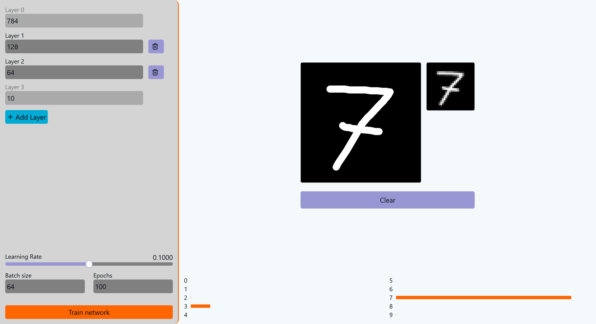
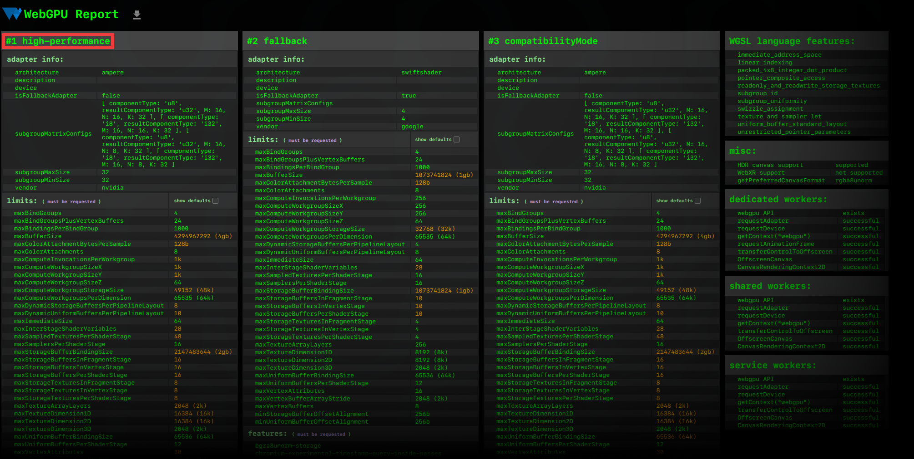
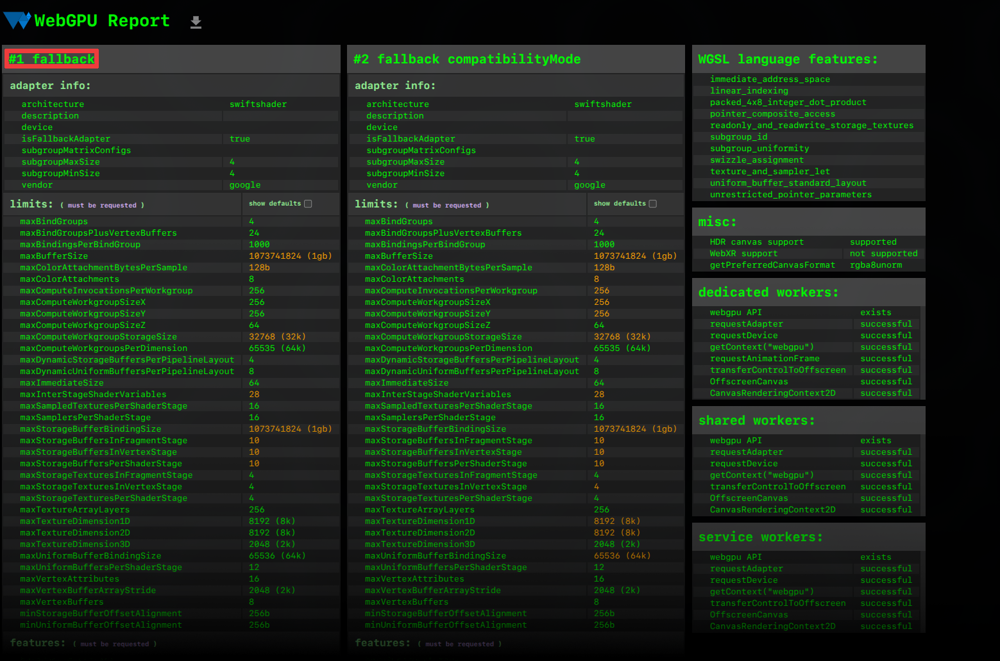
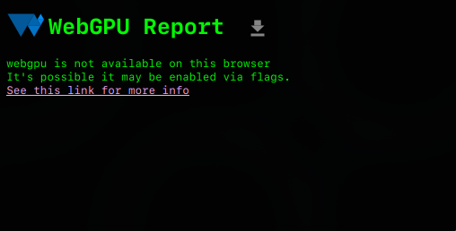

<div align="center">
    <h1>Neurorust</h1>
</div>

<div align="center">
    <p>
        
    </p>
    <p>
        Neurorust lets you train a simple neural network in your browser,
        using the GPU. The network predicts handwritten digits. After
        training you can draw your own digits and see its predictions.
    </p>
    <p>
        <picture>
            <source media="(prefers-color-scheme: dark)" srcset="./branding/banner_dark.png">
            <source media="(prefers-color-scheme: light)" srcset="./branding/banner_light.png">
            
        </picture>
    </p>
    <a href="https://neurorust.toqtou.me">
        Demo
    </a>
</div>


## Features

- **On device.** Neurorust runs directly in your browser. After loading the web page you can even turn off your internet.
- **WebGPU.** The whole network runs entirely on the GPU using WebGPU for fast results.
- **Predict MNIST.** Neurorust predicts handwritten digits using one of the most popular datasets.
- **Adjustable settings.** You can experiment with different settings to get better (or worse) results.


## Running it locally

To run this project you need:
- [rust](https://rust-lang.org/tools/install/)
- [git](https://git-scm.com/install/windows)
- [node](https://nodejs.org/en/download)
- [wasm-pack](https://wasm-bindgen.github.io/wasm-pack/installer/)
- A browser supporting WebGPU (see [Compatibility](#Compatibility)).

In order to compile rust to web assembly you need to install the wasm32-unknown-unknown target:
```bash
rustup target add wasm32-unknown-unknown
```

To compile and run the website run the following:
```
git clone https://github.com/fritl/neurorust.git
cd neurorust/neural_net
wasm-pack build --release --target web --out-dir ../frontend/src/wasm-pkg/
cd ../frontend
npm i
npm run dev
```
Then just open [http://localhost:3000](http://localhost:3000)


## Hyperparameter tips

The best hyperparameters I found were the following:
- Architecture: 784 -> 128 -> 64 -> 10
- Learning rate: 0.1
- Batch size: 64
- Epochs: 50

Generally if you choose a batch size like 256 training is much faster.
The more epochs you choose the better the accuracy you get but if you push it
too far it won't get better.

## How it works

After building the neural network in Rust, I wanted to improve it with GPU
support. Rust has excellent libraries for this. I used `wgpu` to
communicate with the GPU and `wasm-pack` to compile everything to WebAssembly.
This let me run the whole network in the browser with no server needed.

You can try it yourself. Load the website, turn off your internet and
start training.


## Compatibility

WebGPU is a relatively new addition to browser therefore compatibility is still
a bit tricky. The easiest way to check compatibility on your device is to visit
[webgpureport.org](https://webgpureport.org).

If WebGPU is available you will see one _high performance_ adapter. If you see
this Neurorust will most likely work


WebGPU has a fallback mode which uses all CPU cores instead of an actual GPU.
While Neurorust still works with the fallback it is not recommended to run.
Your CPU will get really hot and your system might freeze during the time of
training.


If WebGPU is not available in your browser you will see the following:


On Windows the latest version of your browser will most
likely support WebGPU. If not try updating your browser.

If you are using Linux WebGPU might be available with some additional flags.
There is no simple solution for every distro and browser. You should probably
consult the Internet or an LLM you trust.

On Apple devices WebGPU is enabled by default since version 26.0. It is
reccomended that you use Safari because other browsers might be significantly
slower or not work at all. Apple restricts GPU access in some cases. If
training does not work try plugging in your device or trying
again later.

## Possible improvements

This project taught me a lot. It is my first time using Rust, and my first time working with GPUs and WebAssembly. This left room for improvement:

- **Matrix multiplication:** Could be optimized with tiling and shared memory.
- **GPU memory management:** Not well optimized.
- **Code structure:** The overall Rust code could be cleaner. With more planning up front, the architecture would be better.
